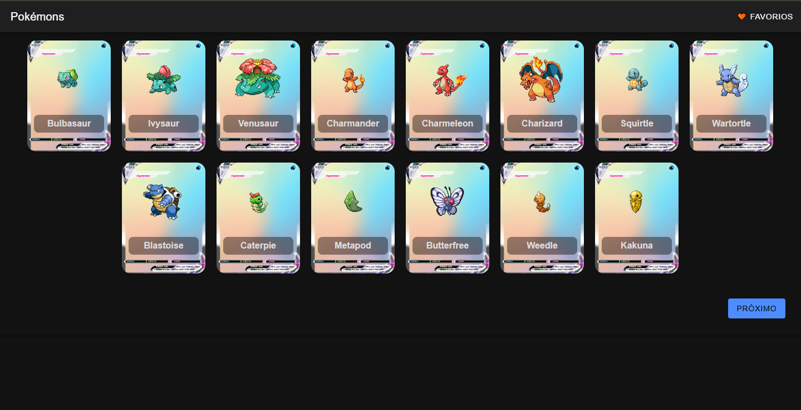
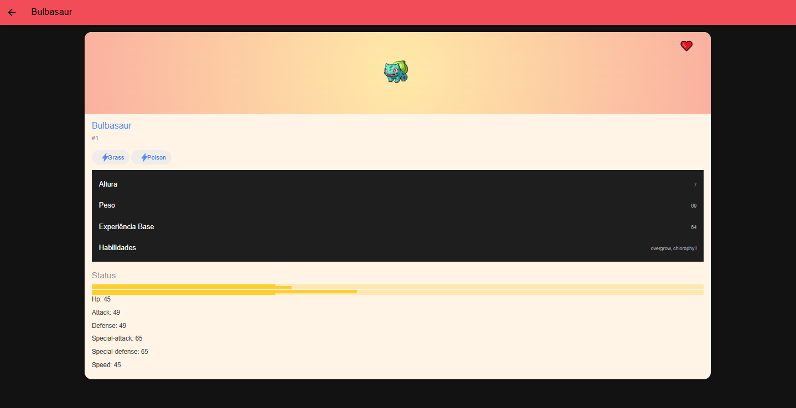
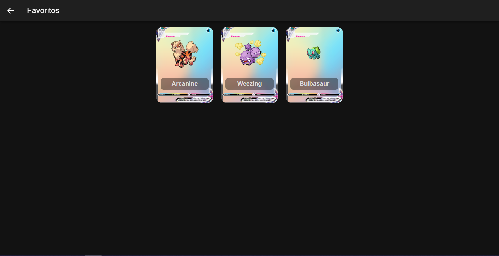
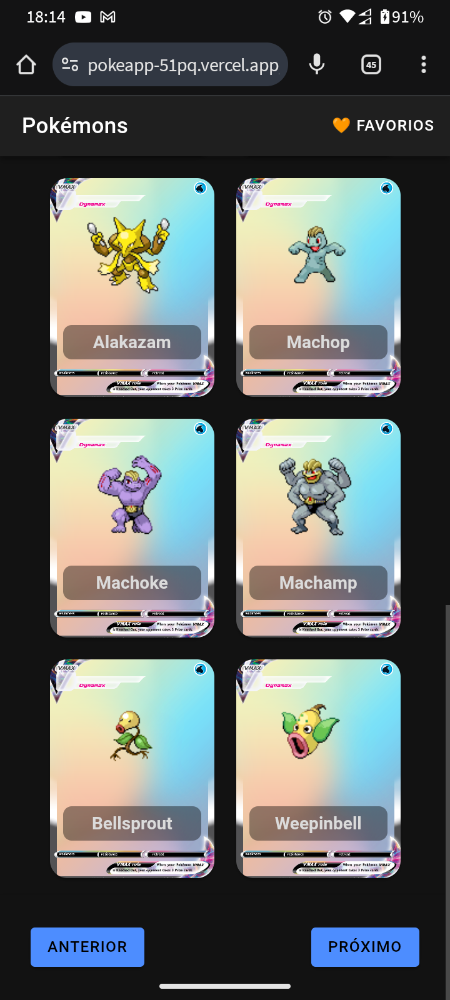
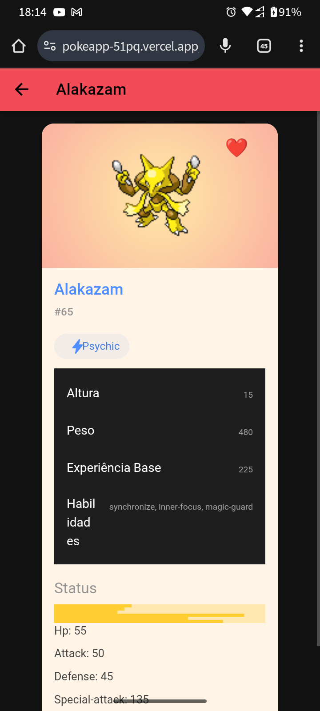
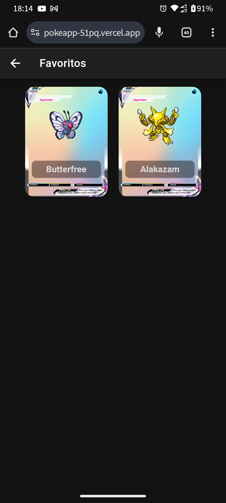

# 📱 Pokédex Ionic Angular

Aplicativo desenvolvido com **Ionic + Angular** que consome a [PokeAPI](https://pokeapi.co) para listar Pokémons, visualizar detalhes e marcar como favoritos. Projeto responsivo, com paginação, navegação entre rotas e deploy na Vercel.

---
## 🔗 Acesse o App

Você pode testar a Pokédex diretamente no navegador clicando no link abaixo:

👉 [https://pokeapp-51pq.vercel.app/](https://pokeapp-51pq.vercel.app/)

## 🎥 Demonstração

> 📷 **Imagem do App:**
> *Desktop:
> 
> 
> 

 *Smartphone:
> 
> 
> 

---

## 🚀 Funcionalidades

- ✅ Listagem de Pokémons com paginação
- ✅ Detalhes completos com imagem, stats, habilidades, tipos
- ✅ Marcar/desmarcar como **favorito**
- ✅ Tela de favoritos
- ✅ Roteamento entre páginas (`/home`, `/details/:id`, `/favorites`)
- ✅ Responsividade para celular, tablet e desktop
- ✅ Scroll automático ao trocar de página
- ✅ URL com parâmetro `?page=N` refletindo a página atual
- ✅ Deploy na Vercel
- ✅ Código modular com injeção de dependências

---

## 🧱 Tecnologias Utilizadas

- [Angular 16+](https://angular.io/)
- [Ionic Framework](https://ionicframework.com/)
- [TypeScript](https://www.typescriptlang.org/)
- [PokeAPI RESTful](https://pokeapi.co/)
- [Vercel](https://vercel.com/) (deploy)

---

